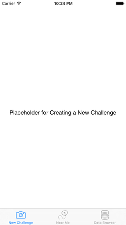
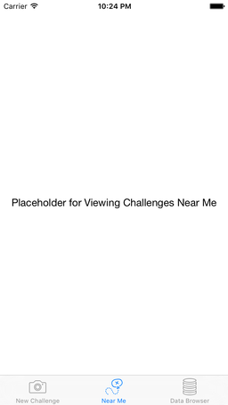
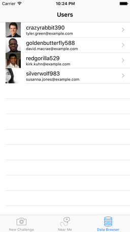

# iSpyChallenge

This repository contains an Xcode project that is used as a starting point for the iSpy App programming challenge used.

## Process

The goal of the challenge is to provide a springboard for you to be able to really demonstrate your core strengths.  During a four hour block of time you will be asked to build a portion of a small iOS application.  The Xcode project in this repo contains a starting point for your work. There are three tabs in the application. The first two are placeholders for  your work. The third tab contains a data browser for exploring the sample data included with the project.

You may use your own computer system for this exercise.  

Clone the project on GitHub and work from your public repo.  When finished with the challenge please push your work back to your clone of the repo so we can take a look at the results.  Be sure to tell your interviewer what your GitHub user name is.

Your goal is to implement the "New Challenge" and "Near Me" tabs in the app.  Refer to the documentation provided earlier for details on the model objects and what functionality the user interface should include.

You will have 3 hours to work on the project. 

## Xcode Project Overview

The model objects for the app are provided, along with some sample data for use during the exercise. All data is maintained in an in-memory persistent store,and is reloaded each time the app is launched.
 
A helper class called PhotoController is provided to store and retrieve photos from a local directory.  The sample data set includes a number of challenges, each with a photo.

There are four users and six challenges in the sample data set.  The challenges are randomly assigned to users each time the sample data is loaded.

The UI for the project consists of three tabs (New Challenge, Near Me, Data Browser).  The first two are placeholders for your work and the third one provides a means to view the sample data included with the project.

NOTE: The base project is written in Objective-C. Feel free to use Objective-C, Swift or both for your solution.

## Screen Shots

